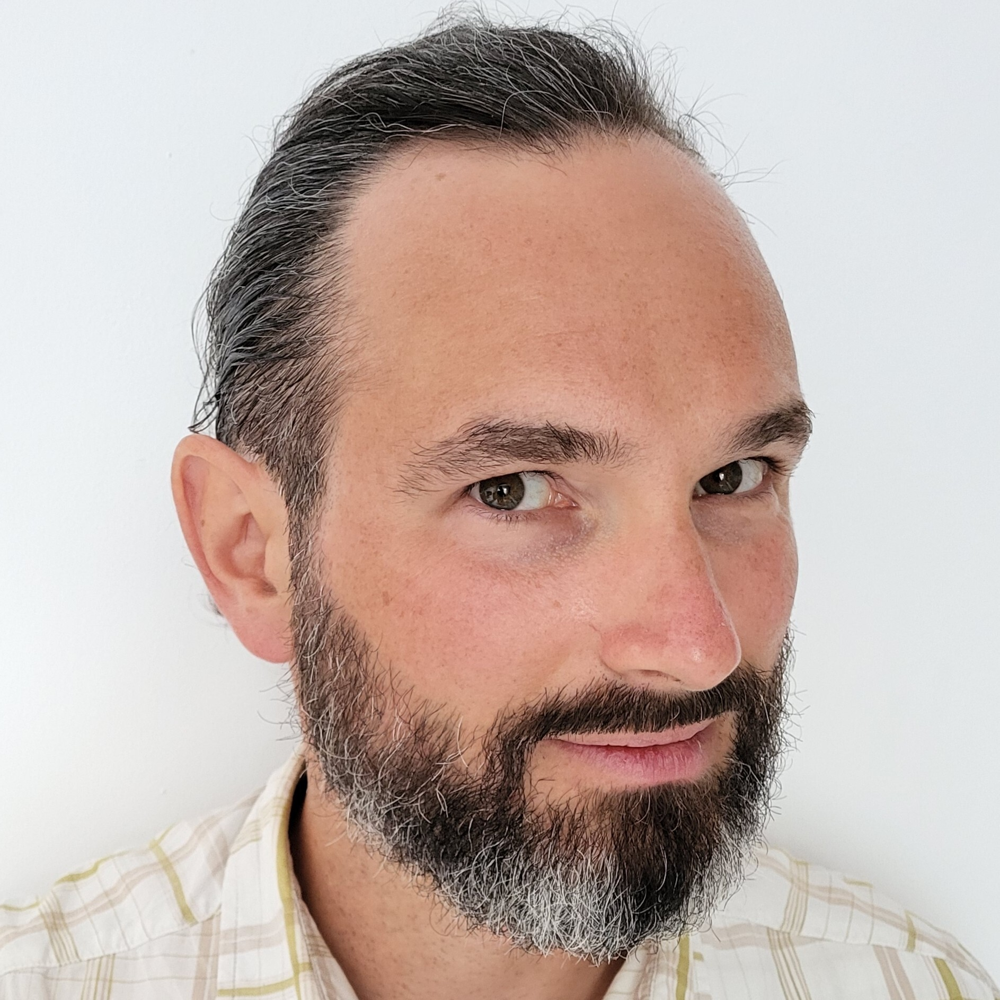
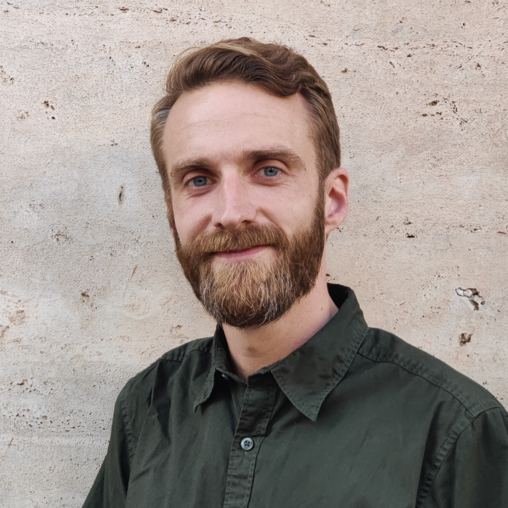

# DevOps Skåne Talk Request

By adding account details and/or Personal Information, You permit to share your information with the public repository.
Including sharing on social media such as Meetup.com, Twitter, Linkedin, etc.

> Note! Please don't share any Email addresses.

## Speaker Info

**Your Name:** Cristian Klein and Lars Larsson

**Linkedin (optional):** [@cristianklein](https://www.linkedin.com/in/cristianklein/) and [@llarsson](https://www.linkedin.com/in/llarsson/)

**Github (optional):** @cristiklein @llarsson

## About Talk

**Meetup Group**: DevOps Skåne

**Date**: Tuesday, March 5, 2024

**Topic:** Developer experience in regulated industries - it doesn't actually suck!

**Abstract:** 

Regulated industries: healthcare, banking, insurance, transport, energy... the list goes on. 
Especially with the new NIS2 regulation, almost all developers will work in a “regulated industry”. 
Certainly a lot of SaaS is covered. 
Most developers think that as information security requirements go up, Developer Experience (DX) plummets. 
By the end of this talk, we hope that you are as convinced as we are that the opposite is true!

This talk will be about:

- Why the EU increasingly forces your boss to see information security as a feature and not "overhead".
- What EU regulations you need to tell your boss about.
- What you need to know to help your boss comply with EU regulations.
- How Policy as Code can give the immediate feedback us developers are used to.
- How deployment via GitOps is not just safer, but also ties very naturally into our code review process.
- How container platforms can offer security in layers outside of the application itself, embedding it in security without code changes.

**Bio:** 

Cristian is the Compliant Kubernetes product owner at Elastisys.
He reviews data protection regulations and security best practices, to translate those into Kubernetes and Cloud Native solutions.
Cristian has gathered over 19 years of experience acting variously as an on-call network engineer, consultant, teacher and researcher.
You can follow him on LinkedIn, where he posts about topics at the intersection of data protection and Kubernetes.

Lars is the Field CTO of Elastisys. 
He is one of the original architects of Elastisys Compliant Kubernetes, and now spends a lot of his time evangelizing around Elastisys cloud native service offerings, understanding customer requirements, and making sure that development experience is top notch.
Lars has worked in both industry and academia since 2008, contributing to the cloud computing field both via open source projects via his research on cloud capacity management. 
You can follow him on LinkedIn, where he posts about Kubernetes, security, DevOps, and compassionate leadership. 

**Agenda:** 

17:30-17:45 - Meet & Greet 
17:45-17:50 - Fredrik to present DevOps Skåne and Jonathan to present Elastisys
17:50-18:10 - Presentation 1: “EU needs you to comply!” – Cristian (Bad cop)
18:10-18:30 - Presentation 2: “Great developer experience AND compliance” – Lars (Good cop)
18:30-18:50 - Pizza & Drinks
18:50-19:30 - Q&A/Continued Discussion

### Meta

How many people will talk?
- [ ] 1 Person (Recommended)
- [x] 2 Persons
- [ ] 3 or more (Not Recommended)

How long will your talk be?
- [x] 40-45 minutes (Recommended)
- [ ] 45+ minutes or more (Not Recommended)

Do you need help crafting your talk?
- [ ] Yes
- [x] No

Do you need a specific adapter to connect to the projector? We provide HDMI and DP.
- [ ] Yes
- [x] No

Venue to Host Meetup.
- [x] FooCafe
- [ ] Other

Live streaming of presentation if available.
- [x] Yes
- [ ] No
