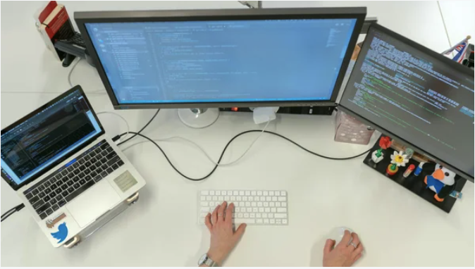

**Photo:**

**Topic:** 10 things we hate about platform engineering

**Abstract:** 
Platform Engineering is the latest blockbuster in the tech world, but like any major production, it comes with its share of potential pitfalls and dramatic twists when stepping into this new frontier.

Join Dan Grøndahl and Emma Dahl Jeppesen from VELUX to hear their biggest pain points in Platform Engineering, explained through analogies from popular movies.

This talk isn’t focused on the usual tools or technologies; you won’t find a single line of YAML here. Instead we’re focussing on the fundamental misunderstandings and missteps that can derail even the most well-funded platform initiatives. From the executive suites’ elusive buy-ins to the gritty realities of inadequate developer experiences, we dive into the top ten common errors that many encounter but few talk about openly.

So grab your popcorn and expect to be entertained, maybe even learn a thing or two!

**Bio:** 
*Emma Dahl Jeppesen* is a Platform Advocate for VELUX, formerly working as a Product Manager within the DevEx and Platform Engineering space. Initially working in the media industry, she fell in love with the product, organizational and cultural aspects of software engineering when she randomly ended up as a Product Owner for a DevOps team. Emma is passionate about helping developers achieve their goals, gathering insights and ensuring user-centricity in platform teams.

*Dan Grøndahl* is the Platform Owner for the CCoE team in VELUX, having the overall responsibility of building great internal developer products for VELUX’ software engineers. An experienced DevOps engineer, he’s spent the last 5 years working as a consultant, guiding many organizations in their DevOps, Platform Engineering and DevEx efforts. Dan’s focus is always bettering the organizations and people around him, oftentimes with an emphasis on cultural and human aspects.

