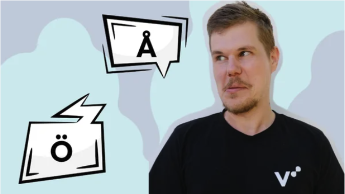

# DevOps Malmö Talk Request

By adding account details and/or Personal information, You give permission to share your information to the public repository.
Including sharing on social media such as Meetup.com, Twitter, Linkedin, etc.
> Note! Please don't share any Email addresses.

## Speaker Info

**Your Name:** Jacob Lärfors

**Twitter (optional):** @jlarfors

**Linkedin (optional):** @jlarfors

**Github (optional):** @jlarfors

## About Talk

**Meetup Group**: DevOps Malmö

**Date**: Tuesday 30th January 2024

**Photo:**

**Topic:** From DevOps Teams to Platform Teams and what did we solve?

**Abstract:** 
DevOps was never intended to be a role, and certainly not the function of a team. However, many organisations looking to implement DevOps did what they do best: create a function around it and start a team. One can argue, however, that DevOps teams did ultimately have a positive impact. Since Platform Engineering became the latest hype, many teams are being rebranded from “DevOps” to “Platform” with an apparent focus on Developer Experience. With this new buzzword, can we finally figure out what DevOps teams were supposed to do?

**Bio:** 
Jacob Lärfors.
Founder and Consultant at Verifa.

Jacob is a pragmatic engineer who enjoys helping teams with all things continuous and cloud.
He lives in Helsinki, Finland and likes technology, music and juggling.

**Agenda:** 
17:30 - 17:45 Meet & Greet 
17:45 - 18:30 From DevOps Teams to Platform Teams and what did we solve? 
18:30 - 18:50 Pizza & Drinks 
18:50 - 19:30 QA/Continue Discussion

### Meta

How many people will talk?

- [x] 1 Person (Recommended)
- [ ] 2 Persons
- [ ] 3 or more (Not Recommended)

How long will your talk be?

- [x] 40-45 minutes (Recommended)
- [ ] 45+ minutes or more (Not Recommended)

Do you need help crafting your talk?

- [ ] Yes
- [x] No

Do you need a specific adapter to connect to the projector? We provide HDMI and DP.

- [ ] Yes
- [x] No

Venue to Host Meetup.

- [x] FooCafe
- [ ] Other
