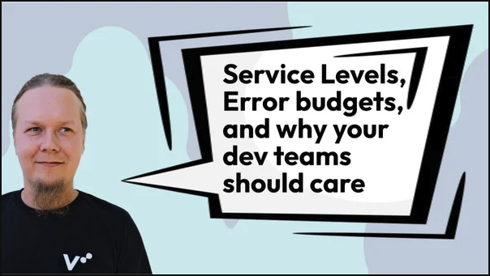

**Photo:**

**Topic:** Service Levels, Error budgets and why your dev teams should care

**Abstract:** 
Developer's make changes, Operations want to keep systems stable. Service Levels exists as a concept to tie these seemingly contradictory goals together, but it is mostly represented in literature and understood as an extension to monitoring, which tends to fall under the operations domain. This fundamental-level talk explains Service levels, Error Budgets and related topics through the lens of an end-user oriented developer team who want to provide their customers the user-experience they yearn.

**Bio:** 
*Lauri Suomalainen* likes Cloud, automation and even people. As a Cloud and DevOps consultant at Verifa, he's on a perpetual quest to bend all of them to his will with a grand goal to build working processes and environments that bring both value and joy.

