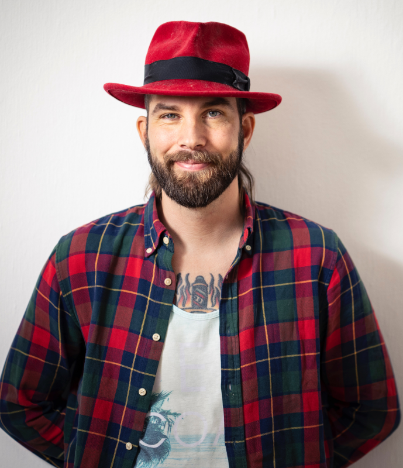
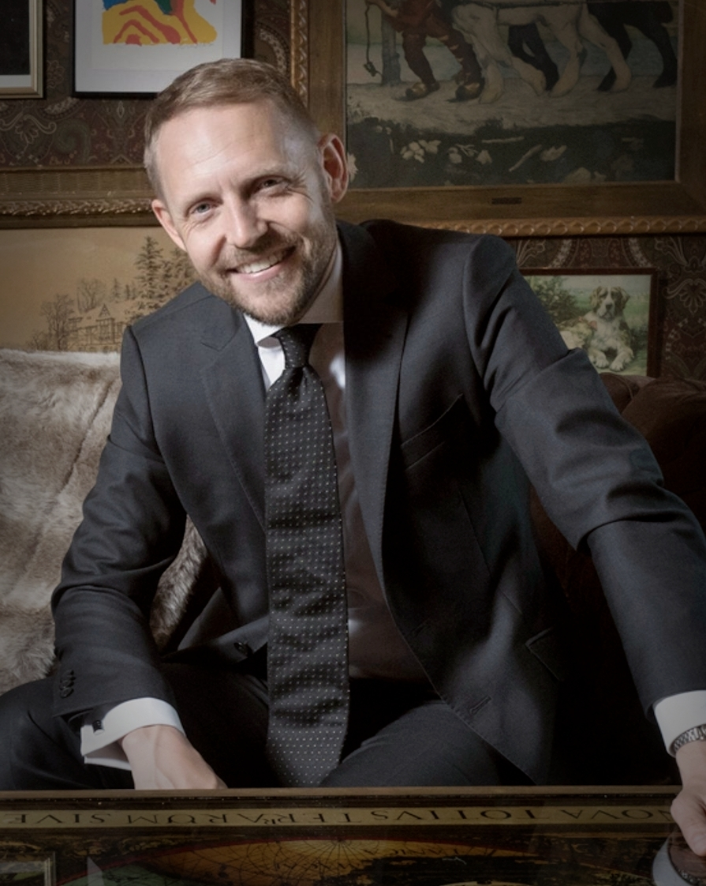

# DevOps Malmö Talk Request
By adding account details and/or Personal Information, You permit to share your information with the public repository.
Including sharing on social media such as Meetup.com, Twitter, Linkedin, etc.
> Note! Please don't share any Email addresses.

## Speaker Info

**Your Name:** Open Source Sweden (Magnus Glantz, Mathias Lindroth)

## About Talk

**Meetup Group**: DevOps Malmö

**Date**: Thursday, 14th of December, 2023

**Topic:** Starting an Open Source Project - What you need to know

**Abstract:** 

Sweden's Open Source industry association - Open Source Sweden, walks you through all the essential things you need to know when starting or running an open source project.
We will discuss fundamental considerations for successful open source projects, such as:
* Project goals and market positioning
* Project identity and brand
* Governance
* Infrastructure and financing
* Metrics and sustainability
* Licensing and all things legal

This is an useful session for anyone:
* who wants to start an open source project
* who is currently running a project and are looking for ways to improve it
* who wants to understand better how to contribute to open source projects
* who are curious of fundamentals which makes open source projects  

**Bio:** 

Magnus Glantz is a board member of Open Source Sweden, a published author and Principal Solution Architect at Red Hat with a focus on DevSecOps and automation technology.

Mathias Lindroth is a board member of Open Source Sweden. He is also a business lawyer, active for many years, including IT and intellectual property law. With a background as a lawyer and co-owner of a larger Malmö-based law firm, he today divides his time between his own firm, board assignments and, not least, research together with the Software Systems Research Group at the Department of Computer Science at the University of Skövde. 

**Agenda:** 
17:30 - 17:45 Meet & Greet 
17:45 - 18:30 The Presentation 
18:30 - 18:50 Pizza & Drinks 
18:50 - 19:30 QA/Continue Discussion

### Meta

How many people will talk?
- [ ] 1 Person (Recommended)
- [x] 2 Persons
- [ ] 3 or more (Not Recommended)

How long will your talk be?
- [x] 40-45 minutes (Recommended)
- [ ] 45+ minutes or more (Not Recommended)

Do you need help crafting your talk?
- [ ] Yes
- [x] No

Do you need a specific adapter to connect to the projector? We provide HDMI and DP.
- [ ] Yes
- [x] No

Venue to Host Meetup.
- [x] FooCafe
- [ ] Other

Live streaming of presentation if available.
- [x] Yes
- [ ] No
